# TRIE Parser
This is a university project. It was done using all the C++ basics studied during the course.

The goal of the project is to write two containers: `trie<T>` (main container) and `bag<T>` (support container). To build the `trie<T>` container, you must parse an appropriately formatted file using a context-free grammar.

Below is explained:

1. The meaning of the `trie<T>` data type
2. The textual format to be parsed
3. Which operations are supported by the container
4. Instructions on project submission and evaluation

## 1. Definitions

The `trie<T>` container must be internally implemented as a *tree*.

In Computer Science, a tree is a set of *nodes* and *edges*.
Edges connect nodes together. Using a recursive definition, we can say that a tree is:

- a node called the "parent", `p`;
- it has 0 or more "children";
- the children are themselves trees;
- for each child `c`, there exists an edge `(p,c)` that connects the parent `p` to the child `c`.

In particular, there always exists a node without a parent called the *root* of the tree; nodes without children are called *leaves*.

The `trie<T>` container implements a tree where edges are labeled with a value of type `T` and where leaves are labeled with a value of type `double`. For example, Figure 1 is a graphical representation of the content of a `trie<char>`.

	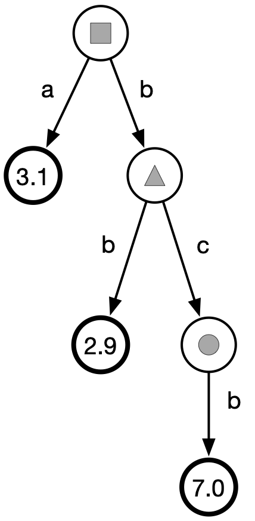
 	 
  	Figure 1: A graphical example of trie&lt;char&gt;. The parent of the node marked with a circle is the node marked with a triangle. The root is the node marked with a square. The leaves are all nodes that contain a double value.

A `trie<T>` corresponds to a set of sequences of values of type `T` where each sequence has a *weight*. There exists one sequence for each leaf of the tree. The weight of a sequence is the double value stored in the corresponding leaf.

A sequence is logically obtained by *concatenating* the labels on each edge encountered along a path from the root to the corresponding leaf.
For example, the `trie<char>` in Figure 1 represents the following set (for simplicity, sequences of `char` are displayed as strings):

	{(a,3.1), (bb,2.9), (bcb,7.0)}

That is, the set composed of sequence `a` with weight `3.1`, sequence `bb` with weight `2.9`, and sequence `bcb` with weight `7.0`.

## 2. File Format Syntax for `trie<T>`

The type `T` must satisfy the following requirements for `trie<T>` to be well-defined:

- Type `T` must define `operator<`, `operator==`, `operator<<`, and `operator>>`. For the operation in Section 3.9.2 (optional), `operator+` is also required.
- Objects of type `T`, when written to a `std::ostream` (via `operator<<`), must not contain separators (spaces, tabs, newlines, etc.).

For example, `T=double` satisfies the above requirements. Also `T=std::string` satisfies them, as long as the strings do not contain separators.

According to the recursive definition given above, the base case of `trie<T>` is a leaf. A leaf is represented textually as follows:

	x children = {}

where `x` will be a certain `double` number. For example, the following is a valid file in `trie<T>` format (regardless of type `T`):

	17.5 children = {}

An internal node of the format associated with `trie<T>` is instead encoded textually as

	children = { x1 trie1, x2 trie2, ... }

where `children` is the list of children of the node; `x1`, `x2`, ... are *distinct* values (important! repeated values among child labels are to be considered a format error) of type `T` that label the edges entering the children, and `trie1`, `trie2`, ... are (recursively) the children of the node (i.e., `trie<T>` instances).
Note that `x trie` pairs are separated by a comma. For example, the following is a valid file in `trie<char>` format that represents the trie in Figure 1.

	children = {
	  a 3.1 children = {},
	  b children = {
		b 2.9 children = {},
		c children = {
			b 7.0 children = {}
		}
	  }
	}

**Note:** The textual format can contain spaces/tabs/newlines at any point, except within the keyword `children` and (obviously) within `double` numbers.

Another example. The following is a valid file for a `trie<double>`.

	children = {
	  3.14 17.0 children = {},
	  2.71 children = { 1.61 children = { 9.8 16.1 children = {} } },
	  6.67 4.3 children = {}
	}

The graphical representation of the `trie<double>` from the previous example is shown in Figure 2.

	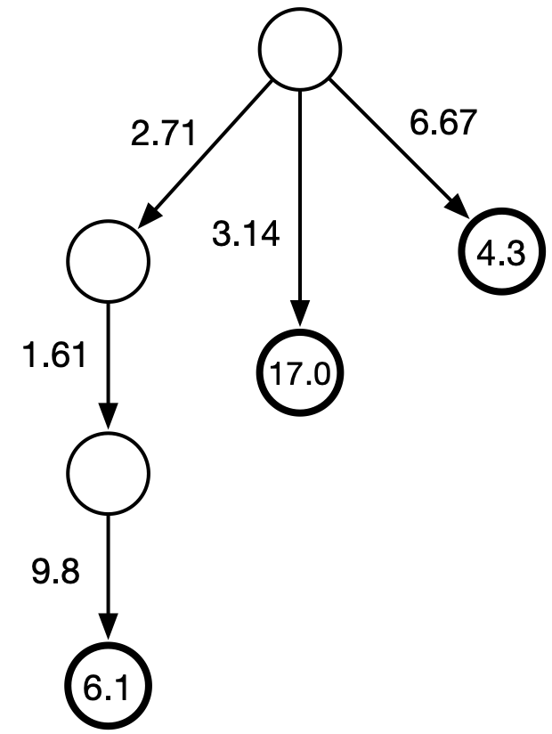
 	 
  	Figure 2: example of trie&lt;double&gt;

The set corresponding to the trie in Figure 2 is `{(<2.71,1.61,9.8>,6.1), (<3.14>,17.0), (<6.67>,4.3)}`, where the notation `<x,y,z,...>` indicates a sequence of elements (i.e., the notation `(<2.71,1.61,9.8>,6.1)` indicates the sequence with weight `6.1` formed by the three values `2.71`, `1.61`, and `9.8`).

The following is a valid file in `trie<std::string>` format.

	children = {
		languages children = { c++ 1.1 children = {}, java 0.5 children = {} },
		compilers children = { g++ 2.8 children = {}, javac 3.1 children = {} }
	}

The graphical representation of the `trie<std::string>` from the previous example is that of Figure 3.

	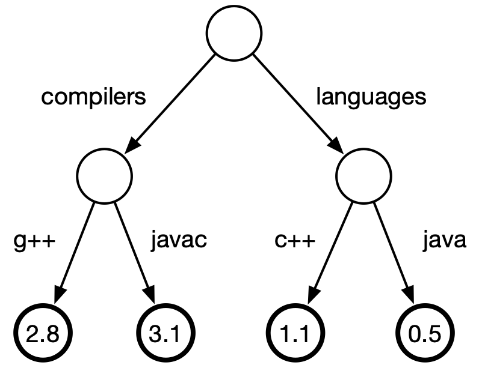
 	 
  	Figure 3: example of trie&lt;std::string&gt;

The set corresponding to the trie in Figure 3 is

	{(<compilers,g++>,2.8), (<compilers,javac>,3.1), (<languages,c++>,1.1), (<languages,java>,0.5)}

**Note:** The type `T` must be known to the compiler. Therefore, you will test the correctness of the `trie<T>` container on files containing values parsable as `T`. For example, the file in Figure 3 can only be correctly parsed by `trie<std::string>` and not by `trie<int>` or others. We will provide example files to test your container where the type `T` can be deduced from the filename (e.g., `trie_char.tr`, `trie_int.tr`, etc.).

**Stream Operators**

The external methods

	template <typename T>
	std::ostream& operator<<(std::ostream&, trie<T> const&);
	
	template <typename T>
	std::istream& operator>>(std::istream&, trie<T>&);

Must, respectively, write a `trie<T>` to `std::ostream` and read a `trie<T>` from `std::istream` in the format described in this section. As shown in class, the `operator>>` method will invoke a parser for the described textual file format, implemented using an appropriate context-free grammar.

## 3. Container `trie<T>`

The container has the following skeleton, as described in the file `include/trie.hpp`.

	template <typename T>
	struct trie {
	
		/* methods and iterators */
	
	private:
		trie<T>* m_p;      // parent
		T* m_l;            // label
		bag<trie<T>> m_c;  // children
		double m_w;        // weight
	};

You are free to implement the `bag` container as you wish, which maintains the set of child nodes sorted by increasing label (using `operator<` appropriately defined on `T`). Note that `trie.hpp` includes `bag.hpp`. You must implement `bag.hpp` in a *header-only* manner, i.e., both declaration and definition of the container must be present in `include/bag.hpp`. We suggest writing `trie.cpp` first and, based on the operations you need on `m_c`, implementing `bag.hpp` afterwards.

**Important:** The file `trie.hpp` must not be modified in any way. In particular, you cannot add class members (new attributes, functions, types). We will compile the code using the version of `trie.hpp` contained in this repository, so if you make modifications to this file, your code will most likely not compile on our system.

**Important:** You cannot include additional libraries in `trie.cpp` and `bag.hpp` (only those already present). During compilation we will remove additional `#include` statements!

Below we describe the methods of `trie<T>`.

### 3.1. Default Constructor and Destructor

	template <typename T>
	trie<T>::trie();
	
	template <typename T>
	trie<T>::~trie();

The default constructor must construct a trie corresponding to the following file.

	0.0 children = {}

### 3.2. Conversion Constructor from double

	template <typename T>
	trie<T>::trie(double w);

Constructs a leaf with weight equal to the argument `w`. For example, `trie<char>::trie(5.1)` must construct a trie corresponding to the following file:

	5.1 children = {}

### 3.3. Copy/Move Semantics

	template <typename T>
	trie<T>::trie(trie<T> const&);
	
	template <typename T>
	trie<T>::trie(trie<T>&&);
	
	template <typename T>
	trie<T>& trie<T>::operator=(trie<T> const&);
	
	template <typename T>
	trie<T>& trie<T>::operator=(trie<T>&&);

**Note**: copy and move assignments must leave the trie on the left of the operator in a consistent state. In particular, if `operator=` is used to replace the sub-trie `u` of a trie `T` with the sub-trie `u'` of a second trie `T'`, then the copy of `u'` inserted in `T` must have its parent in `T`, not in `T'`! Same for the incoming label in `u'`, which must remain the one that `u` had in `T` (this issue was discussed in more detail in one of the issues, check the "closed" issues).

### 3.4. Setters/Getters

Setters/getters are support functions that facilitate writing the parser (the parser is a set of functions external to the class, which do not have access to the private members of trie).
They serve, therefore, only to construct a trie object during parsing: **they should not be used to modify the trie after its creation** (for example, to change the label on an edge).

The method

	template <typename T>
	void trie<T>::set_weight(double w);
	
saves the value `w` as the node's weight, if it is to be considered a leaf. Instead, the method

	template <typename T>
	double trie<T>::get_weight() const;

returns the leaf's weight, if the node on which it is called **is a leaf** (otherwise, the method's behavior is undefined; therefore there is no guarantee that the returned double has a correct meaning).

The method

	template <typename T>
	void trie<T>::set_label(T* l);
	
saves the label `l` for the edge entering the node, if it is **not** to be considered the root of the tree. As mentioned above, this method should not be used to modify the label of an existing edge (it is only used by the parser to assign a label to a trie without a parent).

The method

	template <typename T>
	T const* trie<T>::get_label() const;

Must return the node's label, if the node on which it is called is **not** the root.

The method

	template <typename T>
	void set_parent(trie<T>* p);

establishes that the node's parent is the node pointed to by `p`. Instead, the method

	template <typename T>
	trie<T> const* get_parent() const;
	
returns the trie's parent. The `get_label` and `get_parent` methods must return `nullptr` if the node has no incoming label / parent.

The method

	template <typename T>
	bag<trie<T>> const& get_children() const;	

returns a const reference to the `bag` of children.

Finally, the method

	template <typename T>
	void add_child(trie<T> const& c);

adds the child node `c` to the current node (which we call the parent `p`). Remember to specify a label `l` for the edge `(p,c)` using the `set_label` method on `c` before passing it as an argument to `add_child`. The child `c` will then be added to the `bag` of children of `p` in the appropriate position (see note below).
**Note**: when this function is called on a leaf, the node ceases to be a leaf since it has acquired a child. In particular, the leaf's weight is lost.

**Important:** Children are stored in the `bag` container in **increasing order** by label (recall that labels are all distinct). The ordering is imposed using `operator<` defined on type `T`.

Therefore you **cannot** assume that children are already sorted in the textual format. For example, the following two files are both valid and must generate two identical instances of `trie<std::string>`.

	children = {
		languages children = { c++ 1.1 children = {}, java 0.5 children = {} },
		compilers children = { g++ 2.8 children = {}, javac 3.1 children = {} }
	}

and

	children = {
		compilers children = { javac 3.1 children = {}, g++ 2.8 children = {} },
		languages children = { c++ 1.1 children = {}, java 0.5 children = {} }
	}
 
### 3.5. Comparison

	template <typename T>
	bool trie<T>::operator==(trie<T> const&) const;
	
	template <typename T>
	bool trie<T>::operator!=(trie<T> const&) const;

A trie is equal to another if all nodes and edges are equal (in particular, a node's set of children must store children in the same order as another, which must necessarily be the order imposed by `operator<` on type `T`).
 
### 3.6. Prefix Search: `operator[]`

The methods

	template <typename T>
	trie<T>& trie<T>::operator;
	
	template <typename T>
	trie<T> const& trie<T>::operator const;

Must return a reference/const-reference to the *sub-trie* reached by following **the maximum number** of elements of `s` starting from the root of the trie, in order s[0], s[1], s[2], ... . For example, let `t` be the `trie<std::char>` from Figure 1. After executing the following code:

	std::vector<char> s{'b', 'c', 'z'};
	auto x = t[s];

the variable `x` must contain a reference/const-reference to the *sub-trie* of Figure 4, because from the root of the original trie it is possible to follow `'b'`, followed by `'c'`, but not `'z'`.

	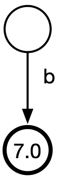
 	 
  	Figure 4: Following the maximum number of elements from the sequence &lt;'b','c','z'&gt;, starting from the root of the trie in Figure 1, this trie is reached.

**Note:** Note that if it is not possible to follow any element of `s`, then the reference to the trie coincides with the reference to the original trie.

### 3.7. Iterators

Iterators point to a node of the trie and, when dereferenced, must return the variable of type `T` that labels the edge entering the node. Keep in mind that all nodes have an incoming edge, except the root. Indeed, the root will be the only node whose iterator must not be dereferenced. For example, let `it` be an iterator to the node highlighted in red in Figure 5. The dereference `*it` must return a reference to the character `c` that labels the edge entering the node.

	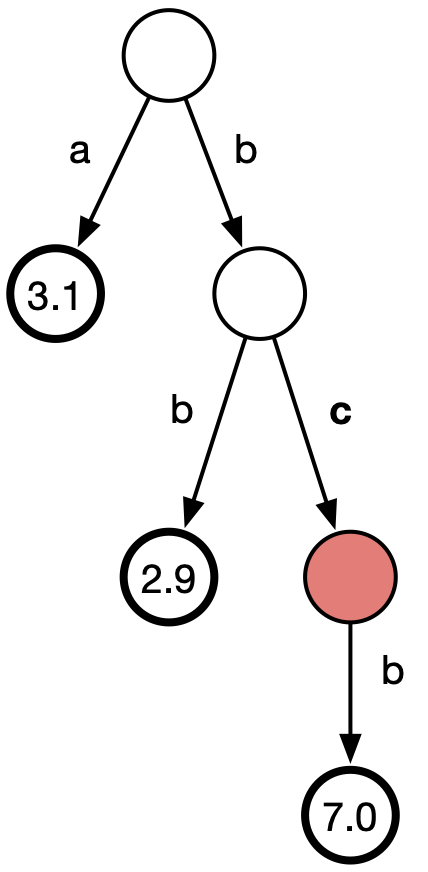
 	 
  	Figure 5: Dereferencing the node highlighted in red yields the label 'c'.

We provide two types of iterators, both of `forward` type. (We ask you to implement both const and non-const versions; for simplicity we only discuss the non-const version below).

The first iterator is `node_iterator`.

	template <typename T>
	struct trie<T>::node_iterator;

This iterator points to any node of the trie. The `operator++` operator must make the iterator point **to the parent of the node**. After a certain number of `++it` operations, the root will necessarily be reached. At this point `it` must be equal to `trie<T>::root()`:

	template <typename T>
	node_iterator trie<T>::root();

Note: `t.root()` always returns a `node_iterator` pointing to node `t`.

The second iterator is `leaf_iterator`.

	template <typename T>
	struct trie<T>::leaf_iterator;

This iterator allows us to navigate the leaves of the trie from "left to right", **following the lexicographic order of the corresponding sequences**.

The `operator++` operator must move the iterator to the next leaf in this order. Calling `operator++` on the last leaf in the order must yield an iterator equal to `trie<T>::end()` (see below).

The following two methods of `trie<T>` return a `leaf_iterator` to the first leaf and to the leaf after the last one.

	template <typename T>
	leaf_iterator trie<T>::begin();
	
	template <typename T>
	leaf_iterator trie<T>::end();

The method

	trie<T> const& get_leaf() const;
	
must return a const reference to the leaf currently pointed to by the iterator. This is convenient for accessing the leaf's attributes (for example, the weight).

The method

	operator node_iterator();

of `trie<T>::leaf_iterator` allows us to convert a `leaf_iterator` into a `node_iterator` that points to the same node of the trie.

Combining the functionalities of the two iterators, we can for example extract all sequences contained in the trie in lexicographic order, as shown in the following code.

	/* assume t is a trie<T> */
	for (auto leaf_it = t.begin(); leaf_it != t.end(); ++leaf_it) {
		trie<T>::node_iterator node_it = leaf_it; // we convert leaf_it into node_it to navigate from leaf to root
		std::vector<T> s;
		while (node_it != t.root()) {
			s.push_back(*node_it);
			++node_it;
		}
		std::reverse(s.begin(), s.end());
		for (auto const& x: s) std::cout << x << ' ';
		std::cout << '\n';
	}

**Note:** There are no `begin()` and `end()` methods that return an iterator of type `node_iterator` or `const_node_iterator`.

**Important:** Iterators must work consistently even on *sub-tries*.
To do this, it is essential to provide an accurate implementation of the `root()`, `begin()` and `end()` methods of `trie<T>`. Indeed, note that on a sub-trie, these methods will return iterators to the root/first leaf/leaf after the last leaf of the *sub-trie* which do **not** necessarily coincide with the root/first leaf/leaf after the last leaf of the trie from which the sub-trie was instantiated. For example, consider the trie in Figure 1. Let's call this trie `t`.
On this trie, `t.begin()` is therefore a `leaf_iterator` to the leaf with weight `3.1`, while `t.end()` is a `leaf_iterator` to the position after the leaf with weight `7.0`. Now consider the trie `t2` constructed as follows:

	std::vector<char> prefix{'b'};
	auto t2 = t[prefix];
	for (auto it2 = t2.begin(); it2 != t2.end(); ++it2) {
		std::cout << *it2 << ' ';
	}

On this trie, `t2.begin()` is therefore a `leaf_iterator` to the leaf with weight `2.9`, while `t2.end()` is a `leaf_iterator` to the position after the leaf with weight `7.0`. In other words, the `for` loop in the code above must correctly navigate only two leaves and print `b b`. Test these functionalities of your code thoroughly!

Finally, the method

	template <typename T>
	trie<T>& trie<T>::leaf_iterator::get_leaf() const;

returns a reference to the leaf pointed to by the `leaf_iterator` instance on which it is called.

### 3.8. Maximum Weight Leaf

The methods

	template <typename T>
	trie<T>& trie<T>::max();
	
	template <typename T>
	trie<T> const& trie<T>::max() const;

Must return a reference/const-reference to the leaf with maximum weight. For example, let `t` be the `trie<std::string>` of Figure 6.

	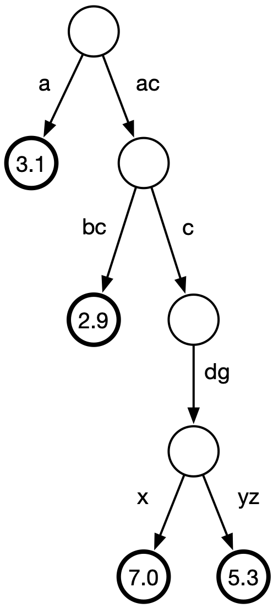
 	 
  	Figure 6: Example of trie&lt;std::string&gt;.

Then `t.max()` is the leaf (with maximum weight 7.0) reached by reading the sequence of strings `<"ac","c","dg","x">`. Note that the same leaf is obtained with the following code (in variable `x`):

	std::vector<std::string> s{"ac","c"};
	auto x = t[s].max();

The syntax `t[s].max()` therefore allows us to reach the leaf with maximum weight whose associated sequence starts with sequence `s`.

### 3.9. Optional Methods

The following methods are optional and give up to a maximum of **4 additional points** if correctly implemented.

#### 3.9.1. Union

The following methods

	template <typename T>
	trie<T> trie<T>::operator+(trie<T> const&) const;
	
	template <typename T>
	trie<T>& trie<T>::operator+=(trie<T> const&);

implement the union of two `trie<T>` objects. In the first case, the operator does not modify the operands and returns a new `trie<T>`. In the second case, the operator adds the right operand to the left one, and returns a reference to the left operand.

The semantics of the two operators above is **set union**, taking care with weights and sequences that are prefixes of other sequences.
Let's consider some examples.

	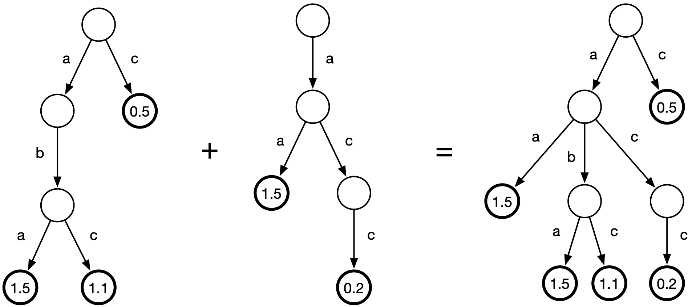
 	 
  	Figure 7: Example of union between two trie&lt;char&gt;.

In the example of Figure 7, the sets of sequences of the two tries are disjoint. More generally, the sets may not be disjoint and the weights of shared sequences must be summed in the result. In other words, if both sets (operands) contain the same weighted sequence `(x,u)` and `(x,v)` (the two weights associated with sequence `x` in the two operands are `u` and `v`), the result must contain the weighted sequence `(x,u+v)`.
Consider the example in Figure 8.

	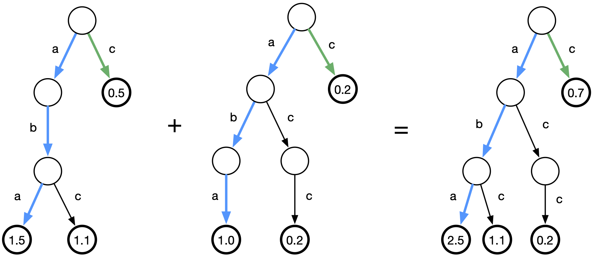
 	 
  	Figure 8: Example of union between two trie&lt;char&gt;.

In the example of Figure 8, sequence `aba` is present in both sets with weights `1.5` and `1.0` respectively (path highlighted in cyan), therefore in the result it appears with weight `1.5 + 1.0 = 2.5`. Same for sequence `c` (path highlighted in green).

More generally: if an operand contains the weighted sequence `(x,u)`, in the result weight `u` must be added to the weight of all sequences `(y,v)` of the other operand such that `x` is a prefix of `y`. Consider the example in Figure 9.

	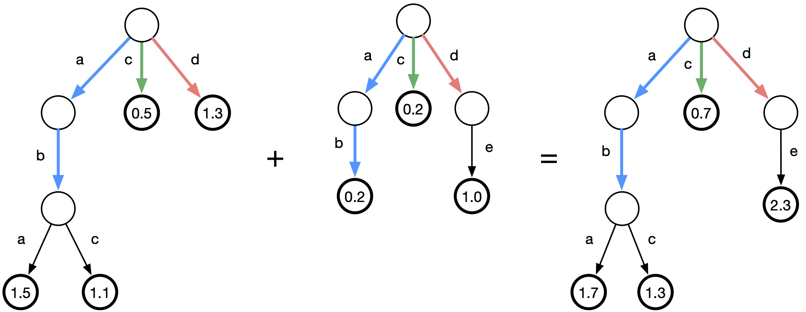
 	 
  	Figure 9: Example of union between two trie&lt;char&gt;.

In the example of Figure 9, sequence `ab` (with weight `0.2`) of the second set (path highlighted in cyan) is a prefix of sequence `abc` in the first set, with weight `1.1`. In the result therefore sequence `abc` must have weight equal to `1.1 + 0.2 = 1.3`. Same for sequence `aba`, which in the result must have weight equal to `1.5 + 0.2 = 1.7`. Similarly, sequence `d` of the first set (path highlighted in red) is a prefix of sequence `de` of the second set, so `de` in the result must have weight equal to the sum of these two sequences: `1 + 1.3 = 2.3`.

**Suggestion:** Implement these operators recursively.

#### 3.9.2. Compaction

The method

	template <typename T>
	void trie<T>::path_compress();

must compact *unary* paths in the trie, i.e., maximal paths formed by nodes with a single child (and their incoming edge and single outgoing edge). The compaction must occur by replacing this path with a single edge whose label is constructed by combining the labels of the edges involved in the unary path using `operator+` of type `T`. The method must modify the trie on which it is called.

Let's see some examples.

If `T=std::string`, then the semantics of `operator+` is that of **string concatenation**. Therefore the trie in Figure 6 is compacted as follows:

	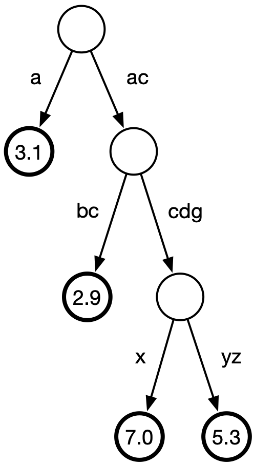
 	 
  	Figure 10: Compaction of the trie in Figure 6 where the path "c" --> "dg" is compacted into "cdg"

In the previous example only one path was compacted, but in general there can be several unary paths in the same trie. A path could also terminate in a leaf.

Another example. If `T=int`, then the semantics of `operator+` is that of **integer addition**. We therefore obtain that the `trie<int>` of Figure 11

	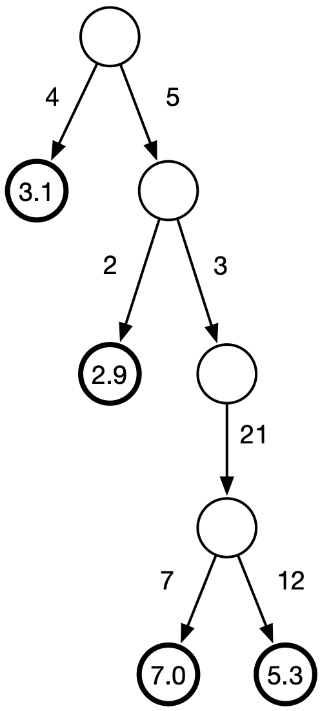
 	 
  	Figure 11: Example of trie&lt;int&gt;.

is compacted into that of Figure 12.

	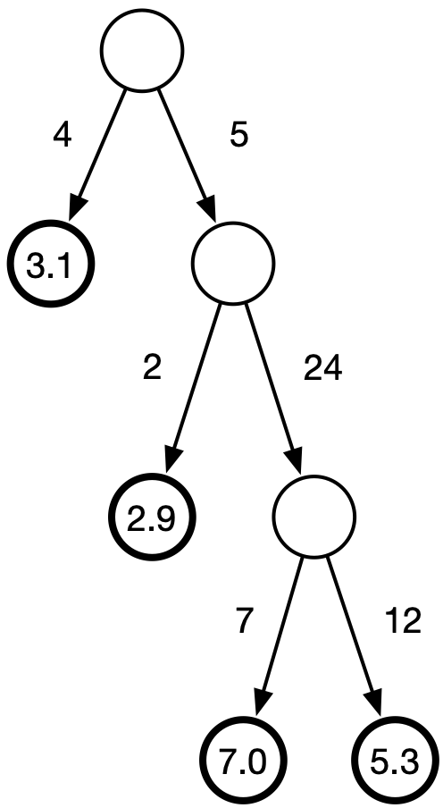
 	 
  	Figure 12: Compaction of the trie in Figure 11.

**Note**: Following compaction, edge labels change. This, in turn, could modify the order of children of nodes involved.
**Note**: If, following compaction, two equal labels are generated among incoming edges of two sibling nodes, the function's behavior is undefined (in particular, you can assume that during testing we will never generate such a situation).
